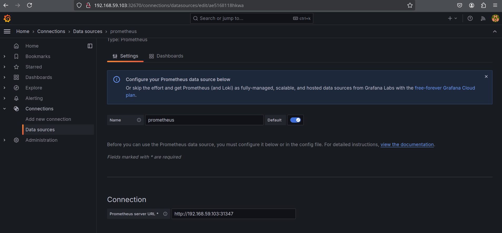
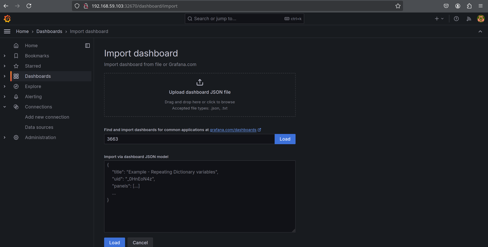
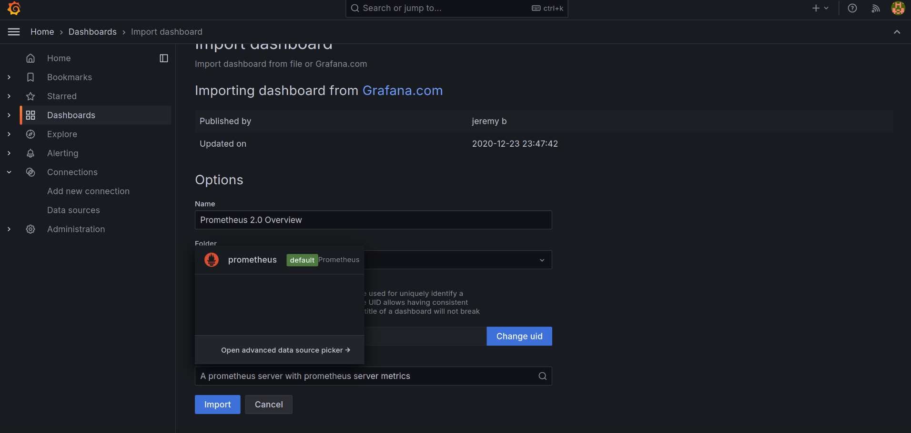
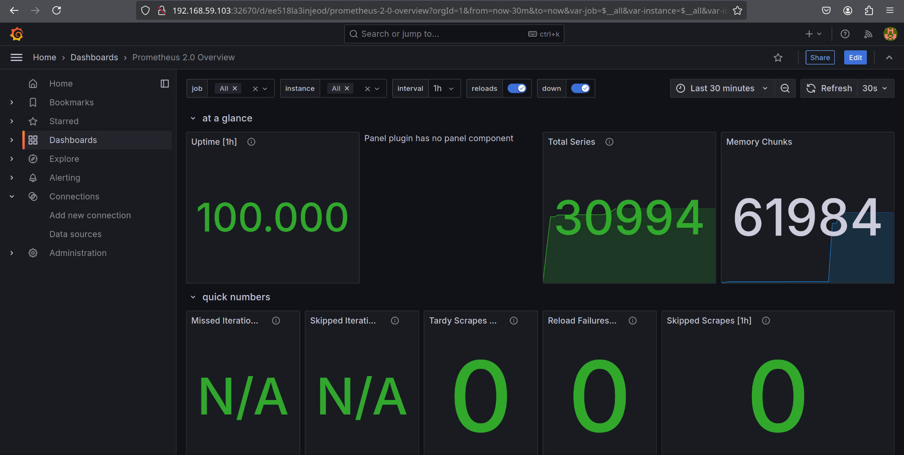
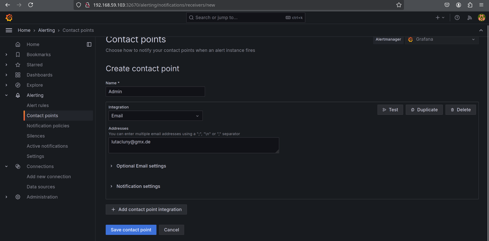
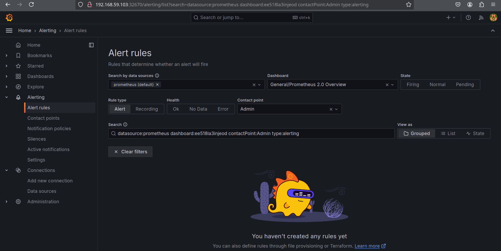

## Start cluster
`minikube start`

## Build images
``` 
minikube image build -t user-service ./user_service/ 

minikube image build -t product-service ./product_service/ 

minikube image build -t order-service ./order_service/

minikube image build -t gateway-service ./gateway_service/ 
```

## Deploy container
`kubectl apply -f k8s/`

## Access the gateway service
`minikube service gateway-service --url`

`curl $(minikube service gateway-service --url)/aggregated`

## Get Prometheus/Grafana running

We assumned prometheus and grafana to be obtained with helm charts.

`kubectl expose service prometheus-server --type=NodePort --target-port=9090 --name=prometheus-server-ext`


`minikube service prometheus-server-ext`
The URL needs to be saved to access prometheus.

`kubectl expose service grafana --type=NodePort --target-port=3000 --name=grafana-ext`

`minikube service grafana-ext`
The URL needs to be saved to access grafana.

## Generate admin password and login 

`kubectl get secret --namespace default grafana -o jsonpath="{.data.admin-password}" | base64 --decode ; echo`

In our case, its: gDnu8CLxXwoPm7muyon4tJYoCdGihR5OXFlJQghp

## Configure Grafana

Add the prometheus source



Import a dashboard 



Add the source


Beautiful!



## Configure alert

The contact point


The rule



